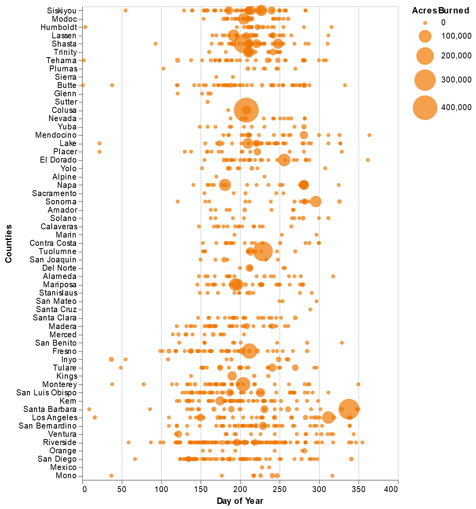
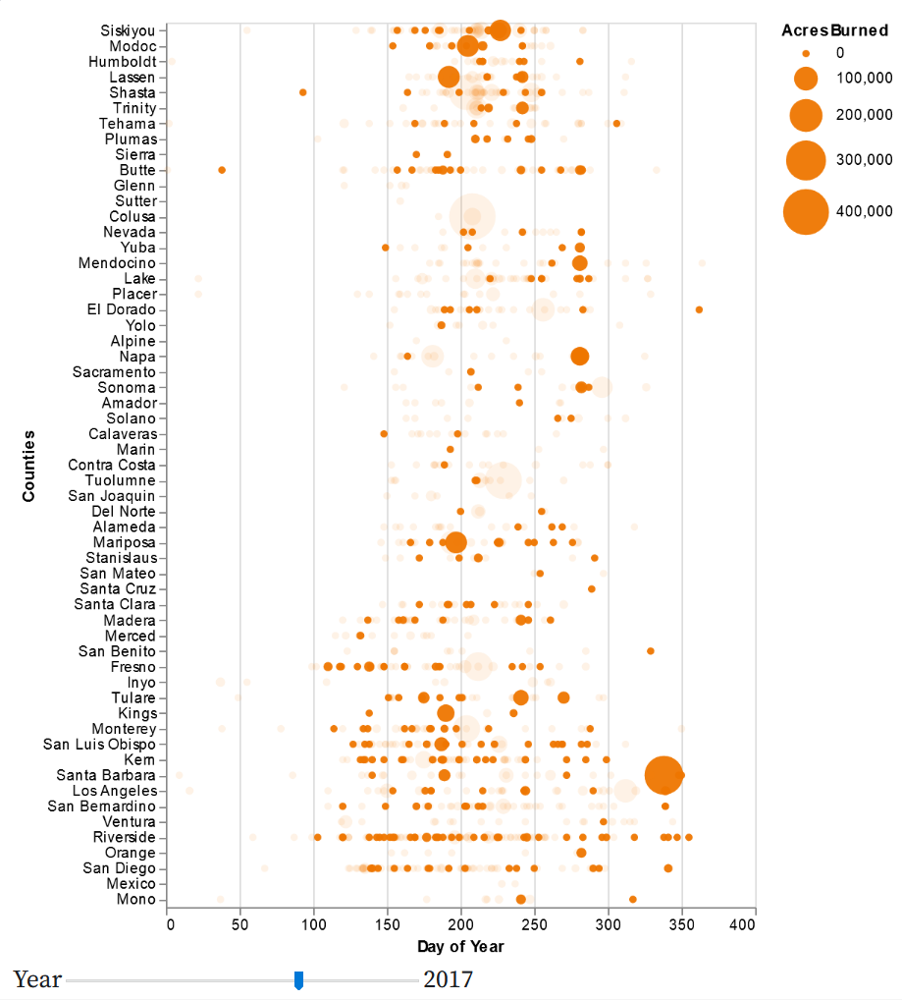
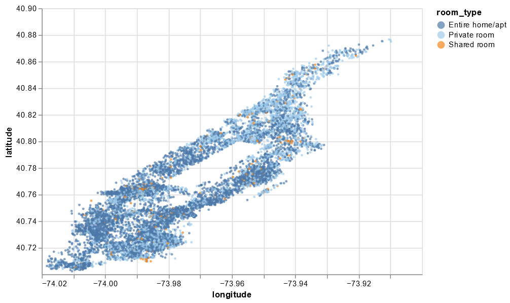
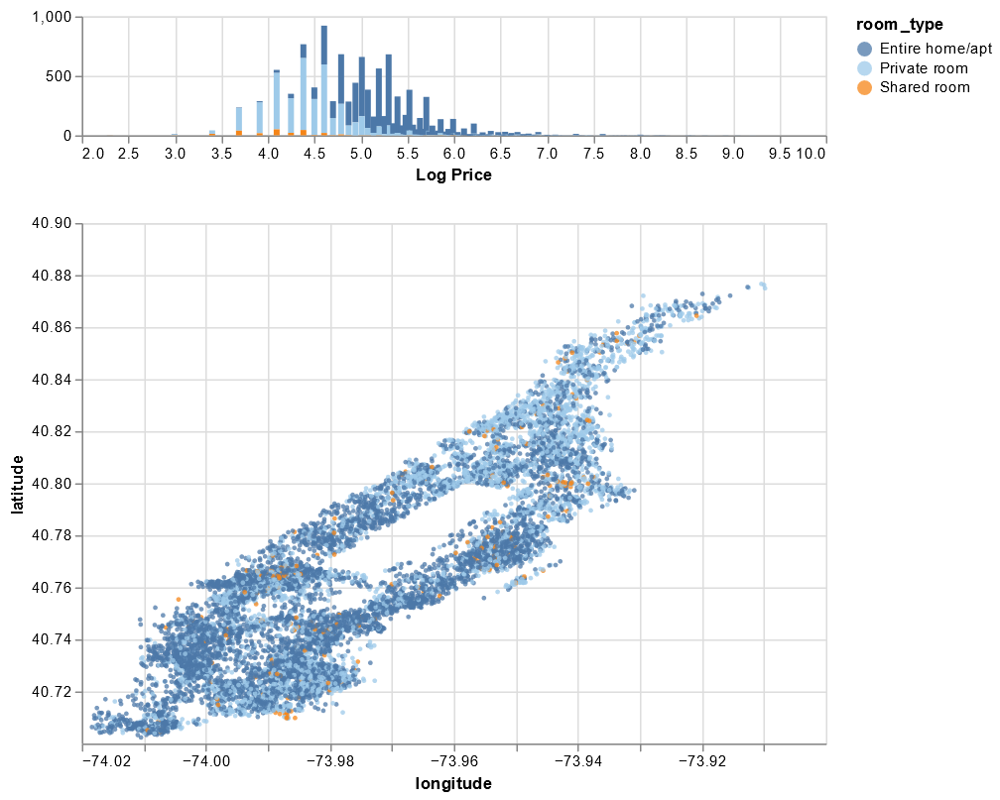

```{r message=FALSE, warning=FALSE}
library(knitr)
library(ggplot2)
library(dplyr)
library(tidyr)
library(readr)
library(gridExtra)
library(skimr)
library(dslabs)
library(naniar)
library(simputation)
library(rpart)
theme_set(theme_minimal())
opts_chunk$set(cache = TRUE, message = FALSE, warning = FALSE)
```


# (1) Plant Growth Experiment

```{r}
plants <- read.csv("https://uwmadison.box.com/shared/static/qg9gwk2ldjdtcmmmiropcunf34ddonya.csv")
```

## Part A
Because the height of the plants is measured in separate columns, I want to pivot height.0,	height.7,	height.14, and height.21 to all be in one days column. Then also translate the respective values for height at each of those time periods. Instead of having days represented as characters, I alsow want to convert days to an integer.

## Part B
```{r}
plants = plants %>% 
  pivot_longer(c(`height.0`, `height.7`, `height.14`, `height.21`), names_to = "height") %>%  
  separate(height, into = c("height", "days"), sep = 7)  

plants = select(plants, -height)

plants$days = as.integer(plants$days)
```

## Part C
```{r}
ggplot(plants) + 
  geom_line(aes(x = days, y = value, col = plantid)) +
  facet_wrap(~ treatment, ncol = 2) +
  labs(
    x = "Days",
    y = "Plant Height",
    title = "Plant Growth Experiment",
    caption = "Note that the plant id's within each treatment are unique"
  )
```


# (2) California Wildfires

````js
fires = aq.fromCSV( await FileAttachment("fires-5.csv").text() )
````

## Part A
I used markPoint to generate this graph. I encoded x to be day_of_year, y to be Countries, and the size of the points to be AcresBurned. I sorted y by median descending latitude. I scalled AcresBurned to make all of the points bigger and easier to see.

````js
{
  return vl.markPoint({filled: true, color: "#EE7600"})
  .data(fires)
  .encode(
        vl.x().fieldQ("day_of_year").title("Day of Year"),
        vl.y().fieldN("Counties").title("Counties").sort(vl.median("Latitude").order("descending")),
        vl.size().fieldQ("AcresBurned").scale({range: [25, 1000]})
        )
  .width(400)
  .height(600)
  .render()
}
````

```{r, echo=FALSE, fig.cap="Q2 Part A", out.width = '100%'}

```

## Part B 
I used the same base graph as in part a, but added a slider using selectSingle. Then added an opactity function based on the slider. I also added a tooltip for fire names.

````js
{
  let selectYear = vl.selectSingle("select").fields("year")
   .init({year: 2013})
   .bind(vl.slider().min(2013).max(2019).step(1).name("Year"))
  return vl.markPoint({filled: true, color: "#EE7600"})
  .data(fires)
  .select(selectYear)
  .encode(
        vl.x().fieldQ("day_of_year").title("Day of Year"),
        vl.y().fieldN("Counties").title("Counties").sort(vl.median("Latitude").order("descending")),
        vl.size().fieldQ("AcresBurned").scale({range: [25, 1000]}),
        vl.tooltip().fieldN("Name"),
        vl.opacity().if(selectYear, vl.value(0.95)).value(0.10)
        )
  .width(400)
  .height(600)
  .render()
    }
````

```{r, echo=FALSE, fig.cap="Q2 Part B", out.width = '100%'}

```


## Part C
I learned that fires usually happen in the summer and months surrounding it, granted that is not surprising. I think it would be really useful to take into account the duration of the fires. The longest fire in this data set was the San Gabriel Complex (Formerly Fish & Reservoir Fires) fire that went on for 672.0472 days, almost two years before it was extinguished. Looking at the interactive visualization I can find which fire that was if I know what I'm looking for, but it honesty just looks like any other fire. This fire is only slightly bigger than the smallest points, and there are several larger area burned fires around it. Considering that a massive area wasn't burned, it makes me question what went on during this fire for it to burn for almost two years before getting extinguished. Adding duration of the fires would assist in providing additional context to the graph and allow new patterns to emerge.

# (3) Pokemon

```{r}
pokemon = read_csv("https://uwmadison.box.com/shared/static/hf5cmx3ew3ch0v6t0c2x56838er1lt2c.csv")
```

## Part A
```{r}
pokemon = pokemon %>% mutate(rate = Attack / Defense)
```

## Part B
```{r}
pokemon %>% group_by(type_1) %>% summarise(avg_rate = median(rate))
```

## Part C
```{r}
type1_order <- pokemon %>%
  group_by(type_1) %>%
  summarise(avg_value = median(rate)) %>% 
  arrange(desc(avg_value)) %>% 
  pull(type_1)

pokemon = pokemon %>% mutate(type_1 = factor(type_1, levels = type1_order))

ggplot(pokemon) + 
  geom_point(aes(x = Attack, y = Defense, col = Legendary)) +
  facet_wrap(. ~ type_1, ncol = 6) +
  geom_abline()+
  labs(title = "Attack vs. Defense Statistics for Different Pokemon")
```

## Part D
In the example above, we faceted by type1. I think it would be useful to use dynamic queries to select by type2 and generation. I would imagine this would look very similar to the second graph from Week 3 lecture 2 in observable. A user could select the generation from 1-6 similar to how they selected rating, and then selected type2 from a drop down menu similar to how they selected genre. The visualization will answer if the generation of the pokemon affects the attack and defense ratio. It will additionally answer if type2 groups of pokemon are related to type1 groups, and how they interact in terms of attack and defense ratios.


# (4) NYC Airbnb Data

````js
airbnb = aq.fromCSV( await FileAttachment("airbnb.csv").text() )
````

## Part A
I based my code for this question off of the movie-ratings-over-time visualization from Week 3[2]. I knew in the later parts of the question I would need to add a histogram and I wanted my code for part a to be compatible with the other parts, so I started with a histogram and scatter plot. This was to ensure my syntax matched as I went through the various parts of this question. So I actually did part b first, then deleted the histogram so the graph would work for part a.

````js
{
  const location = vl.markCircle({size: 10})
    .data(airbnb)
    .encode(
      vl.x().fieldQ('longitude').scale({domain: [-74.02,-73.9]}),
      vl.y().fieldQ('latitude').scale({domain: [40.7,40.9]}),
      vl.color().fieldN('room_type').scale({scheme: 'tableau20'})
    )
    .width(500)
    .height(350);
  return vl.vconcat(location).render();
}
````

```{r, echo=FALSE, fig.cap="Q4 Part A", out.width = '100%'}

```

## Part B
As stated in part a, I started with part b and based if off code from the movie-ratings-over-time visualization from Week 3[2]. I thought I had some big code error initially since it looked like only one point was displaying. After some research and looking at the example graph I found out that I needed to extremely zoom in on the graph, and then it would make sense. I additionally changed the colors for the scale on room type, so it would be easier to distinguish between them.

````js
{
  const brush = vl.selectInterval()
    .encodings('x'); // limit selection to x-axis (year) values
  const price = vl.markBar({width: 4})
    .data(airbnb)
    .select(brush)
    .encode(
      vl.x().fieldQ('log_price').title('Log Price'),
      vl.y().count().title(null),
      vl.color().fieldN('room_type')
    )
    .width(500)
    .height(80);
  const location = vl.markCircle({size: 10})
    .data(airbnb)
    .encode(
      vl.x().fieldQ('longitude').scale({domain: [-74.02,-73.9]}),
      vl.y().fieldQ('latitude').scale({domain: [40.7,40.9]}),
      vl.color().fieldN('room_type').scale({scheme: 'tableau20'}),
    )
    .width(500)
    .height(350);
  return vl.vconcat(price, location).render();
}
````

```{r, echo=FALSE, fig.cap="Q4 Part B", out.width = '100%'}

```

## Part C
Implementing part c was the easiest part of this question, since I only needed one more line of code. In the scatter plot I used vl.opacity() to add a brush that would highlight selected values at 75% opacity and have the rest of the values be 5% opacity.

````js
{
  const brush = vl.selectInterval()
    .encodings('x'); 
  const price = vl.markBar({width: 4})
    .data(airbnb)
    .select(brush)
    .encode(
      vl.x().fieldQ('log_price').title('Log Price'),
      vl.y().count().title(null),
      vl.color().fieldN('room_type')
    )
    .width(500)
    .height(80);  
  const location = vl.markCircle({size: 10})
    .data(airbnb)
    .encode(
      vl.x().fieldQ('longitude').scale({domain: [-74.02,-73.9]}),
      vl.y().fieldQ('latitude').scale({domain: [40.7,40.9]}),
      vl.color().fieldN('room_type').scale({scheme: 'tableau20'}),
      vl.opacity().if(brush, vl.value(0.75)).value(0.05)
    )  
    .width(500)
    .height(350);
  return vl.vconcat(price, location).render();
}
````

```{r, echo=FALSE, fig.cap="Q4 Part C", out.width = '100%'}

```

## Part D
First off, I know New York has some very strict laws and regulations regarding Airbnb's and similar services, so I would encourage them to do plenty of research and refer them to this [link](https://www.airbnb.com/help/article/868/new-york-ny). I know that my friends prefer cheaper housing and if you want to be on the very low end of the log scale, you are going to have a shared room. There are three or four entire home/apt listings under a log price of 3.5. So if you do want a cheap entire home/apt, you should book early because there is a low supply. Additionally I wouldn't worry too much about location. There are plenty of Airbnbs at all price points around the cit. After all it's New York, if you want to go to a different part of the city than you are staying in, there is great public transit.


# (5) Imputing Housing Data

```{r}
housing = read_csv("https://uwmadison.box.com/shared/static/h5u176syp4xkret4w89n70efsp1tubex.csv")
```

## Part A
The plot suggests that building area and price have some kind of relationship, and it would be smart to impute building area by at least price. Ideally you will probably use more variables, but price is a good starting point.

```{r}
ggplot(housing) + 
  geom_miss_point(aes(Price, BuildingArea)) +
  facet_wrap( ~ Regionname, ncol = 2) +
  scale_x_log10() +
  scale_y_log10() +
  labs(
    y = "Building Area",
    title = "Price v. Building Area by Region"
  )
```

## Part B
Since we are trying to estimate values of building area, I used variables for the imputation that I see to be related to building area generally. Normally a five bedroom house is much bigger than a one bedroom house. So in addition to price I also used rooms, bedroom2, and bathroom in my imputation.

```{r}
housing_imputed = housing %>% 
  bind_shadow() %>% 
  as.data.frame() %>% 
  impute_lm(BuildingArea ~ Price + Rooms + Bedroom2 + Bathroom)
```

## Part C
Based on the graph, I think my imputation was fairly successful. The imputed values appear to follow the same joint distribution as the observed data, meaning that the clouds/clusters of points for the imputed data is similar to the clouds/clusters for the observed data. The imputed values seems to follow the joint distribution of the observed data for my imputation better than just imputing by price.

For Northern Victoria there is one outlier in terms of building area in the observed data, but none of the imputed data falls near that outlier. Compared to some of the other plots, Northern Victoria's imputed values follow more of a line and not as much of a cloud/cluster pattern.

```{r}
ggplot(housing_imputed) + 
  geom_miss_point(aes(Price, BuildingArea, col = BuildingArea_NA))+
  scale_y_log10() +
  scale_x_log10() +
  facet_wrap(~Regionname, ncol = 2)+
  labs(
    y = "Log Building Area",
    title = "Price v. Building Area by Region",
    x = "Log Price",
    caption = "!NA points were truly measured. NA points were imputed in part B."
    )
```


# Feedback

a. I started this homework on February 17th and worked pretty intensely on it until the 20th. I got the majority of coding for questions 1-4 done in that time period. I then revisited the assignment this week and did question 5 after our missing data lectures from this week. I then cleaned up my graphs for other questions and answered any questions that were asked within the problems. I would estimate that I spent 15-20 hours on this homework assignment over the last week. 

b. I found question five to be most valuable. This is primarily because it deals with missing data and that's not something I have had to deal with much in the past, but it seems like all of my classes are currently talking about missing data and how big of a deal it is. In STAT 443 we are learning how to deal with missing data using GUIDE, but most workplaces aren't going to be using GUIDE and I need to be able to know what to do with missing data using other methods. In the real world data sets aren't perfect and have a lot of missing values, so I think it's really important that I learn how to deal with this.