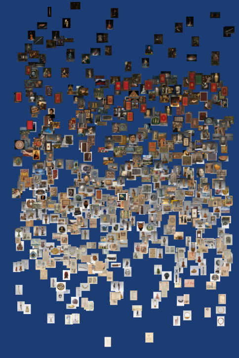
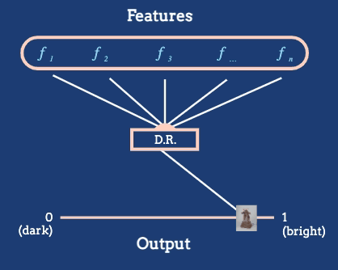

```{r setup, include=FALSE}
knitr::opts_chunk$set(warning = FALSE, message = FALSE)
library("knitr")
```


# Introduction to Dimensionality Reduction

## High-dimensional data
* Data where many features are collected for each observation
* These tend to be wide datasets with many columns
* The name comes from the fact that each row of the dataset can be viewed as a vector in a high-dimensional space (one dimension for each feature)
* These data are common in modern applications,
  + Each cell in a genomics dataset might have measurements for hundreds of molecules.
  + Each survey respondent might provide answers to dozens of questions.
  + Each image might have several thousand pixels.
  + Each document might have counts across several thousand relevant words.
* Low-dimensional data
  + We could visually encode all the features in our data directly, either using properties of marks or through faceting
  + In high-dimensional data, this is no longer possible.

3. However, though there are many features associated with each observation, it may still be possible to organize samples across a smaller number of meaningful, derived features.

## Example
* Consider the Metropolitan Museum of Art dataset, which contains images of many artworks
* Abstractly, each artwork is a high-dimensional object, containing pixel intensities across many pixels
* But it is reasonable to derive a feature based on the average brightness

```{r, fig.cap = "An arrangement of artworks according to their average pixel brightness, as given in the reading.", fig.align = "center"}

```

## Algorithms
* In general, manual feature construction can be difficult
* Algorithmic approaches try streamline the process of generating these maps by optimizing some more generic criterion
* Different algorithms use different criteria, which we will review in the next couple of lectures

```{r, fig.cap = "The dimensionality reduction algorithm in this animation converts a large number of raw features into a position on a one-dimensional axis defined by average pixel brightness. In general, we might reduce to dimensions other than 1D, and we will often want to define features tailored to the dataset at hand.", out.width = 400, fig.align = "center"}

```

## Goals
* Informally, the goal of dimensionality reduction techniques is to produce a low-dimensional "atlas" relating members of a collection of complex objects
* Samples that are similar to one another in the high-dimensional space should be placed near one another in the low-dimensional view
* For example, we might want to make an atlas of artworks, with similar styles and historical periods being placed near to one another


***

# Principal Components Analysis I

Linear dimensionality reduction using PCA.

```{r include=FALSE}
library("tidymodels")
library("readr")
```

## Automation
* In our last notes, we saw how we could organize a collection of images based on average pixel brightness
* We can think of average pixel brightness as a derived feature that can be used to build a low-dimensional map
* We can partially automate the process of deriving new features. Though, in general, finding the best way to combine raw features into derived ones is a complicated problem, we can simplify things by restricting attention to,
  + Features that are linear combinations of the raw input columns.
  + Features that are orthogonal to one another.
  + Features that have high variance.
* Restricting to *linear combinations* allows for an analytical solution. We will relax this requirement when discussing UMAP.

## Orthogonality
* Means that the derived features will be uncorrelated with one another
* This is a nice property, because it would be wasteful if features were redundant

## High variance
* Is desirable because it means we preserve more of the essential structure of the underlying data
* For example, if you look at this 2D representation of a 3D object, it’s hard to tell what it is
* But when viewing an alternative reduction which has higher variance...

```{r, echo = FALSE, fig.cap = "What is this object?", fig.align = "center", out.width = 60}
include_graphics("https://www.huber.embl.de/msmb/images/CAM3.png")
```

```{r, echo = FALSE, fig.cap = "Not so complicated now", fig.align = "center", out.width = 170, preview = TRUE}
include_graphics("https://www.huber.embl.de/msmb/images/CAM4.png")
```
	
## Principal Components Analysis (PCA) 
* The optimal dimensionality reduction under these three restrictions, in the sense that it finds derived features with the highest variance
* Formally, PCA finds a matrix $\Phi \in \mathbb{R}^{D\times K}$ and a set of vector $z_{i} \in \mathbb{R}^{K}$ such that $x_{i}\approx \Phi z_{i}$ for all $i$. 
* The columns of $\Phi$ are called principal components, and they specify the structure of the derived linear features
* The vector $z_{i}$ is called the score of $x_{i}$ with respect to these components
* The top component explains the most variance, the second captures the next most, and so on

### Example
* If one of the columns of $\Phi$ was equal to $\left(\frac{1}{D}, \dots, \frac{1}{D}\right)$
* Then that feature computes the average of all coordinates (e.g., to get average brightness), and the corresponding $z_{i}$ would be a measure of the average brightness of sample $i$.
* Geometrically, the columns of $\Phi$ span a plane that approximates the data. The $z_{i}$ provide coordinates of points projected onto this plane.
* PCA finds a low-dimensional linear subspace that closely approximates the high-dimensional data.

```{r, echo = FALSE}
include_graphics("https://drive.google.com/uc?id=1COajuPX5IOfXoHkZZ3CuVs0qxhisvPla")
```

### tidymodels
* We will see a base R implementation in the next lecture. 
* The dataset below contains properties of a variety of cocktails, from the Boston Bartender's guide. 
* The first two columns are qualitative descriptors, while the rest give numerical ingredient information.

```{r}
cocktails_df <- read_csv("https://uwmadison.box.com/shared/static/qyqof2512qsek8fpnkqqiw3p1jb77acf.csv")
cocktails_df[, 1:6]
```

* The `pca_rec` object below defines a tidymodels recipe for performing PCA. Computation of the lower-dimensional representation is deferred until `prep()` is called. This delineation between workflow definition and execution helps clarify the overall workflow, and it is typical of the tidymodels package.

```{r}
pca_rec <- recipe(~., data = cocktails_df) %>%
  update_role(name, category, new_role = "id") %>%
  step_normalize(all_predictors()) %>%
  step_pca(all_predictors())
pca_prep <- prep(pca_rec)
```

* The `step_normalize` call is used to center and scale all the columns. This is needed because otherwise columns with larger variance will have more weight in the final dimensionality reduction, but this is not conceptually meaningful. For example, if one of the columns in a dataset were measuring length in kilometers, then we could artificially increase its influence in a PCA by expressing the same value in meters. To achieve invariance to this change in units, it would be important to normalize first.

* We can `tidy` each element of the workflow object. Since PCA was the second step in the workflow, the PCA components can be obtained by calling tidy with the argument "2." The scores of each sample with respect to these components can be extracted using `juice.` The amount of variance explained by each dimension is also given by `tidy`, but with the argument `type = "variance"`. We'll see how to visualize and interpret these results in the next lecture.

```{r, fig.cap = "The first five principal components are linear combinations of features."}
tidy(pca_prep, 2)
```

```{r, fig.cap = "The coordinates of a few samples with respect to the princpal components above."}
juice(pca_prep)
```

```{r, fig.cap = "Total variance explained by each component of the PCA."}
tidy(pca_prep, 2, type = "variance")
```


***

# Principal Components Analysis II

```{r}
library("ggplot2")
library("ggrepel")
library("readr")
library("stringr")
library("tidymodels")
library("tidytext")
theme479 <- theme_minimal() + 
  theme(
    panel.grid.minor = element_blank(),
    panel.background = element_rect(fill = "#f7f7f7"),
    panel.border = element_rect(fill = NA, color = "#0c0c0c", size = 0.6),
    legend.position = "bottom"
  )
theme_set(theme479)
```

## Artifacts Produced
* There are three artifacts produced by the procedure worth considering — components, scores, and variances
The components describe derived features, the scores lay samples out on a map, and the variances summarize how much information was preserved by each dimension

```{r}
# produced by code in previous notes
components <- read_csv("https://uwmadison.box.com/shared/static/dituepd0751qqsims22v2liukuk0v4bf.csv") %>%
  filter(component %in% str_c("PC", 1:5))
scores <- read_csv("https://uwmadison.box.com/shared/static/qisbw1an4lo8naifoxyu4dqv4bfsotcu.csv")
variances <- read_csv("https://uwmadison.box.com/shared/static/ye125xf8800zc5eh3rfeyzszagqkaswf.csv") %>%
  filter(terms == "percent variance")
```

## Variance
* First, let's see how much variance is explained by each dimension of the PCA
* Without detouring into the mathematical explanation, the main idea is that, the more rapid the dropoff in variance explained, the better the low-dimensional approximation
* For example, if the data actually lie on a 2D plane in a high-dimensional space, then the first two bars would contain all the variance (the rest would be zero)

```{r, fig.height = 2, fig.width = 4, fig.cap = "Proportion of variance explained by each component in the PCA."}
ggplot(variances) +
  geom_col(aes(component, value))
```

## Components
* We can interpret components by looking at the linear coefficients of the variables used to define them
* From the plot below, we see that the first PC mostly captures variation related to whether the drink is made with powdered sugar or simple syrup
* Drinks with high values of PC1 are usually to be made from simple syrup, those with low values of PC1 are usually made from powdered sugar
* From the two largest bars in PC2, we can see that it highlights the vermouth vs. non-vermouth distinction

```{r, fig.cap = "The top 5 principal components associated with the cocktails dataset."}
ggplot(components, aes(value, terms)) +
  geom_col(show.legend = FALSE) +
  facet_wrap(~component, nrow = 1) +
  labs(y = NULL) +
  theme(axis.text = element_text(size = 7))
```

* It is often easier read the components when the bars are sorted according to their magnitude
* The usual ggplot approach to reordering axes labels, using either `reorder()` or releveling the associated factor, will reorder all the facets in the same way
* If we want to reorder each facet on its own, we can use the `reorder_within` function coupled with `scale_*_reordered`, both from the tidytext package

```{r, fig.width = 10, fig.height = 6, fig.cap = "The top 3 principal components, with defining variables sorted by the magnitude of their coefficient."}
components_ <- components %>%
  filter(component %in% str_c("PC", 1:3)) %>%
  mutate(terms = reorder_within(terms, abs(value), component))
ggplot(components_, aes(value, terms)) +
  geom_col(show.legend = FALSE) +
  facet_wrap(~ component, scales = "free_y") +
  scale_y_reordered() +
  labs(y = NULL) +
  theme(axis.text = element_text(size = 7))
```

## Scores
* Next, we can visualize the scores of each sample with respect to these components
* The plot below shows $\left(z_{i1}, z_{i2}\right)$
* Suppose that the columns of $\Phi$ are $\varphi_{1}, \dots, \varphi_{K}$
* Then, since $x_{i}\approx \varphi_{1}z_{i1} + \varphi_{2} z_{i2}$, the samples have large values for variables with large component values in the coordinate directions where $z_{i}$ is farther along
```{r, fig.height = 6, preview = TRUE, fig.cap = "The scores associated with the cocktails dataset."}
ggplot(scores, aes(PC1, PC2, label = name)) +
  geom_point(aes(color = category), alpha = 0.7, size = 1.5) +
  geom_text_repel(check_overlap = TRUE, size = 3) +
  coord_fixed(sqrt(variances$value[2] / variances$value[1])) # rescale axes to reflect variance
```

## Example
* El Nino has high value for PC1, which means it has a high value of variables that are positive for PC1 (like simple syrup) and low value for those variables that are negative (like powdered sugar)
* Similarly, since $\varphi_{2}$ puts high positive weight on vermouth-related variables, so H. P. W. Cocktail has many vermouth-related ingredients
* In practice, it will often be important to visualize several pairs of PC dimensions against one another, not just the top 2.
* Let’s examine the original code in a little more detail. We are using tidymodels, which is a package for decoupling the definition and execution of a data pipeline. This compartmentalization makes it easier to design and reuse across settings.
```{r}
pca_rec <- recipe(~., data = cocktails_df) %>%
  update_role(name, category, new_role = "id") %>%
  step_normalize(all_predictors()) %>%
  step_pca(all_predictors())
pca_prep <- prep(pca_rec)
```

## PCA without tidymodels
* You have to first split the data into the "metadata" that is used to interpret the scores and the numerical variables used as input to PCA
* Then at the end, you have to join the metadata back in
* It's not impossible, but the code is not as readable
```{r, fig.cap = "A plot of the PCA scores made without using tidymodels."}
# split name and category out of the data frame
pca_result <- cocktails_df %>%
  select(-name, -category) %>%
  scale() %>%
  princomp()
# join them back into the PCA result
metadata <- cocktails_df %>%
  select(name, category)
scores_direct <- cbind(metadata, pca_result$scores)
ggplot(scores_direct, aes(Comp.1, Comp.2, label = name)) +
  geom_point(aes(color = category), alpha = 0.7, size = 1.5) +
  geom_text_repel(check_overlap = TRUE, size = 3) +
  coord_fixed(sqrt(variances$value[2] / variances$value[1])) # rescale axes to reflect variance
```

* The equivalent tidymodels implementation handles the difference between supplementary and modeling data less bluntly, setting the `name` and `category` variables to `id` roles, so that `all_predictors()` knows to skip them.

## Characteristics of PCA to help choose alternative dimensionality reduction methods
* *Global structure*: Since PCA is looking for high-variance overall, it tends to focus on global structure.
* *Linear*: PCA can only consider linear combinations of the original features. If we expect nonlinear features to be more meaningful, then another approach should be considered.
* *Interpretable features*: The PCA components exactly specify how to construct each of the derived features.
* *Fast*: Compared to most dimensionality reduction methods, PCA is quite fast. Further, it is easy to implement approximate versions of PCA that scale to very large datasets.
* *Deterministic*: Some embedding algorithms perform an optimization process, which means there might be some variation in the results due to randomness in the optimization. In contrast, PCA is deterministic, with the components being unique up to sign (i.e., you could reflect the components across an axis, but that is the most the results might change).

***

# Uniform Manifold Approximation and Projection

```{r}
library("ggplot2")
library("readr")
library("tidymodels")
library("embed")
theme479 <- theme_minimal() + 
  theme(
    panel.grid.minor = element_blank(),
    panel.background = element_rect(fill = "#f7f7f7"),
    panel.border = element_rect(fill = NA, color = "#0c0c0c", size = 0.6),
    legend.position = "bottom"
  )
theme_set(theme479)
```

## Nonlinear Dimension Reduction
* Nonlinear dimension reduction methods can give a more faithful representation than PCA when the data don’t lie on a low-dimensional linear subspace.
* For example, suppose the data were shaped like this. There is no one-dimensional line through these data that separate the groups well. We will need an alternative approach to reducing dimensionality if we want to preserve nonlinear structure.

```{r, fig.cap = "An example nonlinear dataset where projections onto any straight line will necessarily cause the classes to bleed together."}
moons <- read_csv("https://uwmadison.box.com/shared/static/kdt9qqvonhcz2ssb599p1nqganrg1w6k.csv")
ggplot(moons, aes(X, Y, col = Class)) +
  geom_point() +
  scale_color_brewer(palette = "Set2")
```

## UMAP
* From a high-level, the intuition behind UMAP is to 
  + (a) build a graph joining nearby neighbors in the original high-dimensional space 
  + (b) layout the graph in a lower-dimensional space
* For example, consider the 2-dimensional sine wave below. If we build a graph, we can try to layout the resulting nodes and edges on a 1-dimensional line in a way that approximately preserves the ordering.

```{r, fig.cap = "UMAP (and many other nonlinear methods) begins by constructing a graph in the high-dimensional space, whose layout in the lower dimensional space will ideally preserve the essential relationships between samples.", echo = FALSE}
include_graphics("https://uwmadison.box.com/shared/static/k4hrx2s4cqmmheg6u0yclir8op42sb0s.png")
```

* A natural way to build a graph is to join each node to its $K$ closest neighbors. The choice of $K$ will influence the final reduction, and it is treated as a hyperparameter of UMAP.

```{r, fig.cap = "When using fewer nearest neighbors, the final dimensionality reduction will place more emphasis on effectively preserving the relationships between points in local neighborhoods.", echo = FALSE}
include_graphics("https://uwmadison.box.com/shared/static/ns6mpykr2zux3t35wuejc7ybtxngm98e.png")
```

* Larger values of $K$ prioritize preservation of global structure, while smaller $K$ will better reflect local differences. This property is not obvious a priority, but is suggested by the simulations described in the reading.

```{r, fig.cap = "When using larger neighborhoods, UMAP will place more emphasis on preserving global structure, sometimes at the cost of local relationships between points.", echo = FALSE, preview = TRUE}
include_graphics("https://uwmadison.box.com/shared/static/70utv1s9yv3h5kturf6i02knhi2jw2dl.png")
```

## One detail in the graph construction
* In UMAP, the edges are assigned weights depending on the distance they span, normalized by the distance to the closest neighbor
* Neighbors that are close, relative to the nearest neighbors, are assigned higher weights than those that are far away, and points that are linked by high weight edges are pulled together with larger force in the final graph layout
* This is what the authors mean by using a "fuzzy" nearest neighbor graph
* The fuzziness allows the algorithm to distinguish neighbors that are very close from those that are far, even though they all lie within a $K$-nearest-neighborhood.

## Graph Layout
* Once the graph is constructed, there is the question of how the graph layout should proceed
* UMAP uses a variant of force-directed layout, and the global strength of the springs is another hyperparameter
* Lower tension on the springs allow the points to spread out more loosely, higher tension forces points closer together. This is a second hyperparameter of UMAP.

```{r, fig.keep='hold', out.width = 200, echo = FALSE}
include_graphics(c("https://uwmadison.box.com/shared/static/g6uqg4dauzfea0qrymaw5m77hl79adem.png", "https://uwmadison.box.com/shared/static/vo96qoakuzm8kx8h7sbuqfaulksfvm1j.png"))
```

* These two hyperparameters — the number of nearest neighbors $K$ and the layout tension — are the only two hyperparameters of UMAP.
* You can see more examples of what this algorithm does to toy datasets in the [reading](https://pair-code.github.io/understanding-umap). Note in particular the properties that the algorithm *does not* preserve. The distance between clusters should not be interpreted, since it just means that the graph components were not connected. Similarly, the density of points is not preserved.

## Implementation
In R, we can implement this using almost the same code as we used for PCA. The `step_umap` command is available through the embed package.

```{r}
cocktails_df <- read_csv("https://uwmadison.box.com/shared/static/qyqof2512qsek8fpnkqqiw3p1jb77acf.csv")
umap_rec <- recipe(~., data = cocktails_df) %>%
  update_role(name, category, new_role = "id") %>%
  step_normalize(all_predictors()) %>%
  step_umap(all_predictors(), neighbors = 20, min_dist = 0.1)
umap_prep <- prep(umap_rec)
```

* UMAP returns a low-dimensional atlas relating the points, but it does not provide any notion of derived features.

```{r, fig.cap = "The learned UMAP representation of the cocktails dataset."}
ggplot(juice(umap_prep), aes(umap_1, umap_2)) +
  geom_point(aes(color = category), alpha = 0.7, size = 0.8) +
  geom_text(aes(label = name), check_overlap = TRUE, size = 3, hjust = "inward")
```

## Summarize properties of UMAP
* *Global or local structure*: The number of nearest neighbors $K$ used during graph construction can be used modulate the emphasis of global vs.  local structure.
* *Nonlinear*: UMAP can reflect nonlinear structure in high-dimensions.
* *No interpretable features*: UMAP only returns the map between points, and there is no analog of components to describe how the original features were used to construct the map.
* *Slower*: While UMAP is much faster than comparable nonlinear dimensionality reduction algorithms, it is still slower than linear approaches.
* *Nondeterministic*: The output from UMAP can change from run to run, due to randomness in the graph layout step. If exact reproducibility is required, a random seed should be set.

***

# PCA and UMAP Examples

```{r}
library("embed")
library("ggplot2")
library("ggrepel")
library("readr")
library("stringr")
library("tidymodels")
library("tidytext")
theme479 <- theme_minimal() + 
  theme(
    panel.grid.minor = element_blank(),
    panel.background = element_rect(fill = "#f7f7f7"),
    panel.border = element_rect(fill = NA, color = "#0c0c0c", size = 0.6),
    legend.position = "bottom"
  )
theme_set(theme479)
set.seed(479)
```

These notes don’t introduce any new conceptual material. Instead, they give a few examples of how PCA and UMAP can be used.

## From two dimensions to one
* We presented the two moons dataset earlier as an example where UMAP, but not PCA, would be able to discover a one-dimensional representation that separates the groups
* The implication is that, if we anticipate some sort of nonlinearity in higher-dimensions (which we can't directly visualize), then UMAP would be a more suitable choice

```{r, fig.cap = "The original two moons dataset. We will ask both PCA and UMAP to recover a 1D reduction of these 2D data."}
moons <- read_csv("https://uwmadison.box.com/shared/static/kdt9qqvonhcz2ssb599p1nqganrg1w6k.csv")
ggplot(moons, aes(X, Y, col = Class)) +
  geom_point() +
  scale_color_brewer(palette = "Set2")
```

* The code block below defines both the PCA and UMAP recipes
* There is no need to normalize the data, since the two dimensions are already on the same scale

```{r}
moons_ <- recipe(~ ., data = moons) %>%
  update_role(Class, new_role = "id")
pca_rec <- step_pca(moons_, all_predictors(), num_comp = 1)
umap_rec <- step_umap(moons_, all_predictors(), num_comp = 1)
```

* The block below shows both the UMAP and PCA representations
* The PCA representation seems to mostly reflect the variation on the $x$-axis of the original data, and the two classes mix together
* On the other hand, the UMAP clearly separates the groups
* This is expected, since the nearest neighborhood graph that defines UMAP is likely separated into two major components, one for each moon

```{r, fig.height = 4, fig.width = 6, fig.cap = "1D PCA and UMAP representations of the 2D two moons dataset."}
scores <- bind_cols(
  prep(umap_rec) %>% juice() %>% mutate(umap_1 = scale(umap_1)),
  prep(pca_rec) %>% juice() %>% select(-Class)
) %>%
  pivot_longer(-Class, names_to = "method")
ggplot(scores, aes(value, method, col = Class)) +
  geom_point(position = position_jitter(h = 0.1), alpha = 0.8) +
  scale_color_brewer(palette = "Set2") 
```

## Antibiotics Dataset
* We can apply dimensionality reduction to the antibiotics dataset described in lecture 2 - 1 
* There, we had filtered down to the 6 most abundant bacteria
* Now we will consider 147 most abundant, which means that each sample can be imagined as a vector in a 147-dimensional space
* Ideally, a dimensionality-reduction procedure should be able to place samples close to one another when they have similar species profiles
* In addition to loading species counts, we load taxonomic information about each species, in the `taxa` variable

```{r}
antibiotic <- read_csv("https://uwmadison.box.com/shared/static/t1lifegdz8s0a8lgckber32ytyh9hu4r.csv")
taxa <- read_csv("https://uwmadison.box.com/shared/static/ng6y6etk79lrm0gtsgw2u0yq6gqcozze.csv")
```

* We now define a PCA recipe. Since the counts are relatively skewed, we log-transform, using `step_log`
* Specifically, we use a $\log\left(1 + x\right)$ transform, since there are many 0 counts
* The rest of the definition is like the 2D example above.

```{r}
antibiotic_ <- recipe(~ ., data = antibiotic) %>%
  update_role(sample:antibiotic, new_role = "id") %>%
  step_log(all_predictors(), offset = 1) %>%
  step_normalize(all_predictors())
pca_rec <- step_pca(antibiotic_, all_predictors())
pca_prep <- prep(pca_rec)
```

* We generate a map of the PCA scores below
* The primary difference is between the three study participants -- D, E, and F
* Within each person, there is some variation between the antibiotic periods, as indicated by the points' colors

```{r, fig.cap = "PCA scores for the antibiotics dataset. The main difference is between study participants, with some secondary variation related to whether the participant was taking the antibiotic at that timepoint."}
scores <- juice(pca_prep) 
variances <- tidy(pca_prep, 2, type = "variance")
ggplot(scores, aes(PC1, PC2, col = antibiotic)) +
  geom_point(aes(shape = ind), size = 1.5) +
  geom_text_repel(aes(label = sample), check_overlap = TRUE, size = 3) +
  coord_fixed(sqrt(variances$value[2] / variances$value[1])) + 
  scale_color_brewer(palette = "Set2")
```

### Which species contribute the most to the principal components? 
* We can analyze this like we did with the cocktails dataset
* In addition to plotting the raw component value, we also join in the taxa information
* This allows us to color in each bar by the species group that each bacteria belongs to
* For example, we see that samples on the right side of the plot above (i.e., high PC1) likely have more Firmicutes than Bacteroidetes
* PC2 seems to pick up on two species that have higher abundance when the rest drop-off

```{r, fig.cap = "The first six principal components associated with the antibiotics dataset."}
components_ <- tidy(pca_prep, 3) %>%
  filter(component %in% str_c("PC", 1:6)) %>%
  mutate(terms_ = reorder_within(terms, abs(value), component)) %>%
  group_by(component) %>%
  top_n(20, abs(value)) %>%
  left_join(taxa)
ggplot(components_, aes(value, terms_, fill = Phylum)) +
  geom_col() +
  facet_wrap(~ component, scales = "free_y") +
  scale_y_reordered() +
  labs(y = NULL) +
  scale_fill_brewer(palette = "Set1") +
  theme(axis.text = element_text(size = 5))
```

### We can use similar code to compute a UMAP embedding
* The UMAP seems to separate the different timepoints more clearly
* However, there is no analog of `components` with which to interpret the different axes
* Instead, a typical approach to interpret the representation is to find points that are close together (e.g., using $K$-means) and take their average species profile

```{r, fig.cap = "The UMAP representation associated with the antibiotics dataset."}
umap_rec <- step_umap(antibiotic_, all_predictors(), min_dist = 1.5)
umap_prep <- prep(umap_rec)
scores <- juice(umap_prep) 
ggplot(scores, aes(umap_1, umap_2, col = antibiotic)) +
  geom_point(aes(shape = ind), size = 1.5) +
  geom_text_repel(aes(label = sample), max.overlaps = 10) +
  scale_color_brewer(palette = "Set2")
```

## Image Data

* Both PCA and UMAP can be used on image data
* Here, each pixel in an image is considered a different feature. For example, the FashionMNIST dataset includes 60,000 28 x 28 images of fashion objects
* We can think of image as a vector $x_{i} \in \mathbb{R}^{784}$
* The goal of dimensionality reduction in this context is to build an atlas of images, where images with similar overall pixel values should be located next to one another
* First, we read in the data and subsample it, so the code doesn't take so long to run

```{r}
fashion <- read_csv("https://uwmadison.box.com/shared/static/aur84ttkwa2rqvzo99qo7yhxemoc6om0.csv") %>%
  sample_frac(0.2) %>%
  mutate(
    image = row_number(),
    label = as.factor(label)
  )
```

* Each row of the matrix above is a separate image
* We can prepare a PCA recipe just like in the two examples above
* Note that we are not normalizing the features -- the pixels are already on a common scale

```{r}
fashion_ <- recipe(~ ., data = fashion) %>%
  update_role(label, image, new_role = "id")
pca_rec <- step_pca(fashion_, all_predictors())
pca_prep <- prep(pca_rec)
```

```{r, echo = FALSE}
pivot_scores <- function(scores, fashion, scale_factor=12, max_images=300) {
  scores %>%
    bind_cols(select(fashion, -image, -label)) %>%
    filter(image < max_images) %>%
    pivot_longer(starts_with("pixel")) %>%
    mutate(
      pixel = as.numeric(str_replace(name, "pixel", "")),
      w = pixel %% 28,
      h = 28 - floor(pixel / 28),
      x = x + scale_factor * w,
      y = y + scale_factor * h
    )
}
overlay_images <- function(scores_joined, scale_factor=12) {
  ggplot(scores_joined) +
    geom_tile(
      aes(x, y, alpha = value, fill = label),
      width = scale_factor, height = scale_factor
    ) +
    scale_alpha(range = c(0, 1)) +
    scale_fill_brewer(palette = "Set3") +
    scale_color_brewer(palette = "Set3") +
    coord_fixed()
}
```

*  The code below extracts the PCA scores and visualizes them as a cloud of points
* Each point corresponds to an image, and the different types of fashion items are indicated by color
* It seems that the types are well separated, but the labels are not informative... to understand what the colors mean, we need to look at the images

```{r, fig.width = 5, fig.height = 5, fig.cap = "Principal component scores from the fashion dataset."}
scores <- juice(pca_prep) %>%
  rename(x = PC1, y = PC2)
ggplot(scores, aes(x, y, col = label)) +
  geom_point() +
  scale_color_brewer(palette = "Set3") +
  coord_fixed()
```

* The block below overlays the first 300 images from the dataset at the locations from the previous plot
* You can view the function in the rmarkdown link at the top of this document

```{r, fig.width = 5, fig.height = 5, preview = TRUE, fig.cap = "A subset of principal component scores expressed as the corresponding images."}
pivot_scores(scores, fashion) %>%
  overlay_images()
```

* Finally, we can repeat the exercise above with UMAP
* The first plot shows the UMAP scores and the second overlays the same set of 300 images onto these new coordinates
* It seems that UMAP can more clearly separate shoes and pants from shirts and sweaters

```{r, fig.width = 5, fig.height = 5, fig.cap = "The locations of all the images according to UMAP. Each color is a different class."}
umap_rec <- step_umap(fashion_, all_predictors(), num_comp = 2, min_dist = 0.5)
umap_prep <- prep(umap_rec)
scores <- juice(umap_prep) %>%
  rename(x = umap_1, y = umap_2)
ggplot(scores, aes(x, y, col = label)) +
  geom_point() +
  scale_color_brewer(palette = "Set3") +
  coord_fixed()
```

```{r, fig.width = 5, fig.height = 5, fig.cap = "A sample of the images at the locations determined by UMAP."}
pivot_scores(scores, fashion, scale_factor = 0.05) %>%
  overlay_images(scale_factor = 0.05)
```