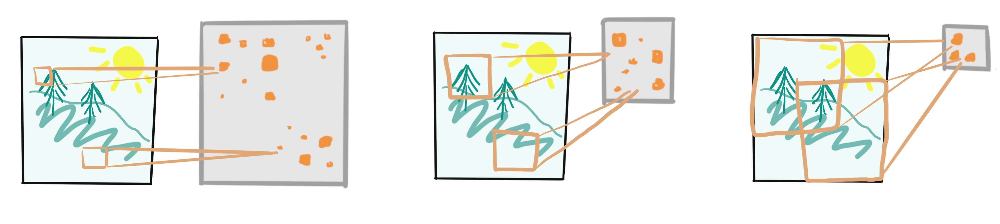

# Overview
*	Introduction to Feature Learning
*	Visualizing Learned Features
*	Collections of Features
* Optimizing Feature Maps 

```{r}
library(knitr)
library(keras)
library(dplyr)
library(purrr)
library(RColorBrewer)
library(magrittr)
library(pdist)
library(stringr)
library(superheat)
library(tidymodels)
library(tensorflow)
set.seed(479)
```

***

# Introduction to Feature Learning
An introduction to compositional feature learning

* In classical machine learning, we assume that the features most relevant to prediction are already available. E.g., when we want to predict home price, we already have features about square feet and neighborhood income, which are clearly relevant to the prediction task.
* In many modern problems though, we have only access to data where the most relevant features have not been directly encoded.
  * In image classification, we only have raw pixel values. We may want to predict whether a pedestrian is in an image taken from a self-driving car, but we have only the pixels to work with. It would be useful to have an algorithm come up with labeled boxes like those in the examples below.
  * For sentiment analysis, we want to identify whether a piece of text is a positive or negative sentiment. However, we only have access to the raw sequence of words, without any other context. Examples from the IMDB dataset are shown below.
* In both of these examples, this information could be encoded manually, but it would a substantial of effort, and the manual approach could not be used in applications that are generating data constantly. In a way, the goal of these algorithms is to distill the raw data down into a succinct set of descriptors that can be used for more classical machine learning or decision making.
    
```{r, echo = FALSE, fig.cap = "An example of the types of labels that would be useful to have, starting from just the raw image."}

```

Example reviews from the IMDB dataset:

```
  positive,"A wonderful little production. <br /><br />The filming technique is very unassuming- very old-time-BBC fashion and gives a comforting, and sometimes discomforting, sense of realism to the entire piece. <br /><br />The actors are extremely well chosen- Michael Sheen not only ""has got all the polari ...."
  positive,"I thought this was a wonderful way to spend time on a too hot summer weekend, sitting in the air conditioned theater and watching a light-hearted comedy. The plot is simplistic, but the dialogue is witty and the characters are likable (even the well bread suspected serial killer). While some may be ..."
  negative,"Basically there's a family where a little boy (Jake) thinks there's a zombie in his closet & his parents are fighting all the time.<br /><br />This movie is slower than a soap opera... and suddenly, Jake decides to become Rambo and kill the zombie.<br /><br />OK, first of all when you're going to ..."
  positive,"Petter Mattei's ""Love in the Time of Money"" is a visually stunning film to watch. Mr. Mattei offers us a vivid portrait about human relations. This is a movie that seems to be telling us what money, power and success do to people in the different situations we encounter. <br /><br />This being a ..."
```

* In these problems, the relevant features only arise as complex interactions between the raw data elements
  * To recognize a pedestrian, we need many adjacent pixels to have a	particular configuration of values, leading to combinations of edges and shapes, which when viewed together, become recognizable as a person.
  * To recognize a positive or negative sentiment, we need to recognize interactions between words. "The movie was good until" clearly has bad sentiment, but you cannot tell that from the isolated word counts alone.
* The main idea of deep learning is to learn these more complex features one layer at a time
  * For image data, the first layer recognizes interactions between individual pixels. Specifically, individual features are designed to "activate" when particular pixel interactions are present. The second layer learns to recognize interactions between features in the first layer, and so on, until the learned features correspond to more "high-level" concepts, like sidewalk or pedestrian
* Below is a toy example of how an image is processed into feature activations along a sequence of layers 
  * Each pixel within the feature maps correspond to a patch of pixels in the original image -- those later in the network have a larger field of view than those early on
  * A pixel in a feature map has a large value if any of the image features that it is sensitive to are present within its field of vision

```{r, fig.cap = "A toy diagram of feature maps from the model loaded below. Early layers have fewer, but larger feature maps, while later layers have many, but small ones. The later layers typically contain higher-level concepts used in the final predictions." , echo = FALSE, out.width = "90%", preview = TRUE}

```
	
* At the end of the feature extraction process, all the features are passed into a final linear or logistic regression module that completes the regression or classification task, respectively
* It is common to refer to each feature map as a neuron. Different neurons activate when different patterns are present in the original, underlying image

```{r, fig.cap = "An illustration of the different spatial contexts of feature maps at different layers. An element of a feature map has a large value (orange in the picture) if the feature that it is sensitive to is present in its spatial context. Higher-level feature maps are smaller, but each pixel within it has a larger spatial context.", echo = FALSE}

```

* Below, we load a model to illustrate the concept of multilayer networks. 
  * This model has 11 layers followed by a final logistic regression layer
  * There are many types of layers
  * Each type of layer contributes in a different way to the feature learning goal, and learning how design and compose these different types of layers is one of the central concerns of deep learning
  * The Output Shape column describes the number and shape of feature maps associated with each layer
  * For example, the first layer has 32 feature maps, each of size $148 \times 148$
  * Deeper parts of the network have more layers, but each is smaller
  * We will see how to load and inspect these features in the next lecture

```{r eval=FALSE, include=FALSE}
f <- tempfile()
download.file("https://uwmadison.box.com/shared/static/9wu6amgizhgnnefwrnyqzkf8glb6ktny.h5", f)
model <- load_model_hdf5(f)
model
```

* While we will only consider image data in this course, the idea of learning complex features by composing a few types of layers is a general one
* For example, in sentiment analysis, the first layer learns features that activate when specific combinations of words are present in close proximity to one another. The next layer learns interactions between phrases, and later layers are responsive to more sophisticated grammar
* Deep learning is often called a black box because these intermediate features are often complex and not directly interpretable according to human concepts.
* The problem is further complicated by the fact that features are "distributed" in the sense that a single human concept can be encoded by a configuration of multiple features. Conversely, the same model feature can encode several human concepts
* For this reason, a literature has grown around the question of interpreting neural networks
  * The field relies on visualization and interaction to attempt to understand the learned representations, with the goal of increasing the safety and scientific usability of deep learning models
  * While our class will not discuss how to design or develop deep learning models, we will get a taste of
the interpretability literature in the next few lectures


***

# Visualizing Learned Features
A first look at activations in a deep learning model.

* In the last lecture, we discussed the conceptual foundations of feature learning
* In this lecture, we’ll see how to extract and visualize features learned by a computer vision model.
* We will inspect a model that was trained to distinguish between photos of cats and dogs
* We've included a subsample of the training dataset below 
* From the printout, you can see that we have saved 20 images, each of size $150 \times 150$ pixels, and with three color channels (red, green, and blue)

```{r}
f <- tempfile()
download.file("https://uwmadison.box.com/shared/static/o7t3nt77iv3twizyv7yuwqnca16f9nwi.rda", f)
images <- get(load(f))
dim(images) # 20 sample images
```

* Let’s take a look at a few examples from the training dataset
* We've randomly sampled 10 dogs and 10 cats
* The command `par` allows us to plot many images side by side (in this case, in a $4 \times 5$ grid)
* The `array_tree` function above splits the 4D array into a collection of 3D slices. Each of these 3D slices corresponds to one image — the three channels correspond to red, green, and blue colors, respectively
* The next `map` line plots each of the resulting 3D arrays

```{r, layout = "l-body-ouset", fig.cap = "A sample of 20 random images from the dog vs. cat training dataset."}
par(mfrow = c(4, 5), mai = rep(0.00, 4))
out <- images %>%
  array_tree(1) %>%
  map(~ plot(as.raster(., max = 255)))
```

* Next, lets consider what types of features the model has learned, in order to distinguish between cats and dogs
* Our approach will be to compute activations on a few images and visualize them as 2D feature maps
* These visualizations will help us see whether there are systematic patterns in what leads to an activation for a particular neuron
* To accomplish this, we will create an R object to retrieve all the intermediate feature activations associated with an input image
* Every time we call this object on a new image, it will return the activations for features at all layers

```{r eval=FALSE, include=FALSE}
# download model
f <- tempfile()
download.file("https://uwmadison.box.com/shared/static/9wu6amgizhgnnefwrnyqzkf8glb6ktny.h5", f)
model <- load_model_hdf5(f)

layer_outputs <- map(model$layers, ~ .$output)
activation_model <- keras_model(inputs = model$input, outputs = layer_outputs)
features <- predict(activation_model, images)
```

* Each element of `features` corresponds to a different layer
* Within a single layer, the 3D array provides the activations of each feature across different spatial windows
* For example, for the first layer, there are 32 features with activations spread across a 148 x 148 grid, each grid element with its own spatial context

```{r}
dim(features[[1]])
```

* The block below visualizes the first feature map in the first layer
* We plot the associated input image next to it
* This feature seems to be a horizontal edge detector -- it activates whenever there are transitions from dark to light areas when moving vertically
* For example, when the white leash goes over the shadow in the background, this feature has some of its highest activations

```{r, fig.cap = "An image and its activations for the first neuron in layer 1."}
plot_feature <- function(feature) {
  rotate <- function(x) t(apply(x, 2, rev))
  image(rotate(feature), axes = FALSE, asp = 1, col = brewer.pal(4, "Blues"))
}

ix <- 3
par(mfrow = c(1, 2), mai = rep(0.00, 4))
plot(as.raster(images[ix,,, ], max = 255))
plot_feature(features[[1]][ix,,, 1])
```

* Let’s visualize a few more of these features
* We see more vertical and horizontal edge detectors — features with high values at sharp changes in color in the underlying images
* This is consistent with our earlier claim that the first layer of a network learns to recognize pixel-level interactions

```{r, layout = "l-body-ouset", preview = TRUE, fig.cap = "Activations for a collection of neurons at layer 2, for the same image as given above."}
par(mfrow = c(6, 7), mai = rep(0.00, 4))
out <- features[[2]][ix,,,] %>%
  array_branch(margin = 3) %>%
  map(~ plot_feature(.))
```

* Next, we visualize features at a higher level in the network
* At this point, each activation corresponds to a larger spatial context in the original image, so there are fewer activations per feature
* There are more feature maps total, but each is smaller
* It's not so clear what these feature maps correspond to, but there do seem to be a few that are clearly activated within the dog, and others that are sensitive to the foliage in the background

```{r, layout = "l-body-ouset", fig.cap = "Activations for a collection of neurons at layer 6.", fig.cap="center"}
par(mfrow = c(6, 7), mai = rep(0.00, 4))
out <- features[[6]][ix,,,1:40] %>%
  array_branch(margin = 3) %>%
  map(~ plot_feature(.))
```

* While we had some interpretations for these higher-level features, it is hard to know definitively, since we are only considering a single image
* In the next set of notes, we will examine the same neuron across many dataset examples, and this will give us more confidence in our interpretations of individual neurons

***

# Collections of Features
Analyzing feature activations across datasets

* The previous notes gave us a look into the features learned by a deep learning model. However, we could only look at one feature within one layer at a time. We also only studied an individual image
* If we want to better understand the representations learned by a network, we will need ways of analyzing collections of features taken from throughout the network, across entire datasets
* This seems like an impossible task, but it turns out that, in real-world models, the learned features tend to be highly correlated.
  * Certain patterns of activation tend to recur across similar images
  * This kind of structure makes it possible to use clustering and dimensionality-reduction to begin to make sense of the learned representations of individual networks
  * To illustrate this idea, we will download the same model from before along with a larger subsample of images used in training

```{r}
f <- tempfile()
download.file("https://uwmadison.box.com/shared/static/dxibamcr0bcmnj7xazqxnod8wtew70m2.rda", f)
images <- get(load(f))

f <- tempfile()
download.file("https://uwmadison.box.com/shared/static/9wu6amgizhgnnefwrnyqzkf8glb6ktny.h5", f)
model <- load_model_hdf5(f)
```

* The code block below save features from layers 6 and 8 from this model, for
all the images we downloaded
  * The code for extracting features is the same as from the previous lecture, except instead of extracting features from all layers, we're only considering these later ones
  * The reason we've focused on these deeper layers is that 
  (1) they are smaller, so we will consume less memory on our computers, and 
  (2) they correspond to the higher-level concepts which are more difficult to understand directly, unlike the simple edge detectors in the initial layers.

```{r}
l <- c(model$layers[[6]]$output, model$layers[[8]]$output)
activation_model <- keras_model(inputs = model$input, outputs = l)
features <- predict(activation_model, images)
```

* Ideally, we could work with a matrix of samples by features. The $ij^{th}$ element would be the activation of feature $j$ on observation $i$
* This is unfortunately not immediately available
* As we saw before, each feature map is actually a small array across spatial contexts, not a single number
* There is no single way to aggregate across a feature map, and it is common to see people use the maximum, average, norm, or variance of a feature map as a summary for how strongly that feature activates on a given image
* We will take the mean of activations

```{r}
feature_means <- function(h) {
  apply(h, c(1, 4), mean) %>%
    as_tibble()
}

h <- map_dfc(features, feature_means) %>%
  set_colnames(str_c("feature_", 1:ncol(.))) %>%
  mutate(id = row_number())
```

* Given this array, we can ask questions like, which neurons are most activated for a particular image? Or, which images induce the largest activations for a particular neuron?
* In the block below, we find the 20 images that activate the most for the third feature map in layer 6. This neuron seems to have learned to recognize grass. Perhaps unsurprisingly, all the images are of dogs

```{r, fig.height = 7, fig.cap = "The 20 images in the training dataset with the highest activations for neuron 3 in layer 6. This neuron seems to be sensitive to the presence of grass in an image (which happens to be correlated with whether a dog is present)."}
top_ims <- h %>%
  slice_max(feature_3, n = 20) %>%
  pull(id)

par(mfrow = c(5, 4), mai = rep(0.00, 4))
out <- images[top_ims,,,] %>% 
  array_tree(1) %>%
  map(~ plot(as.raster(., max = 255)))
```

* This particular example should serve as a kind of warning
  * While it's easy to imbue models with human-like characteristics, they often arrive at the answers they need in unexpected ways
  * We asked the model to distinguish between cats and dogs, but it is using whether the image has grass in it as a predictor
  * While for this dataset this may be accurate, I would expect this model to fail on an image of a cat in a grassy field
* Instead of only investigating one neuron, we can consider all the images and neurons simultaneously
  * The code below makes a heatmap of the average feature activations from before
  * Each row is an image and each column is a feature from either layers 6 or 8
  * A similar example is given in the reading, where coordinated views reveal that certain patterns of neuron activation encode the lifts of the pen or specific curve shapes in a handwriting generation network

```{r, fig.cap = "A heatmap of feature map activations for layers 6 and 8, across the entire dataset. Each row is an image, and each column is a neuron. There is limited clustering structure, but there are substantial differences in how strongly different neurons activate on average."}
superheat(
  h %>% select(-id),
  pretty.order.rows = TRUE,
  pretty.order.cols = TRUE,
  legend = FALSE
)
```

* We can also apply clustering and dimensionality reduction ideas to understand
the collection of mean feature activations
* For example, below we run $K$-means across images, with the hope of finding images that are viewed similarly according to the model
  * The 20 images closest to the centroid of cluster 3 are printed below
  * It seems like the model has learned to cluster all the orange images together. Sometimes, it's just looking at the color of the floor!
  * This is a little surprising, considering that there are both cats and dogs that are orange, so this isn't a particularly discriminating feature
  * It also suggests a way to improve the model -- we could train it on recolorized input images, so that it is forced to discover features that are unrelated to color. In the deep
learning community, this would be called using color augmentation to enforce
invariance

```{r, fig.height = 7, fig.cap = "The 20 images closest to the centroid of cluster 3 in the feature activation space. This cluster seems to include images with many orange pixels."}
sub <- function(x) {
  select(x, starts_with("feature"))
}

cluster_result <- kmeans(sub(h), centers = 25, nstart = 20)
centroids <- tidy(cluster_result)
D <- pdist(sub(centroids), sub(h)) %>%
  as.matrix()

par(mfrow = c(5, 4), mai = rep(0.00, 4))
near_centroid <- order(D[3, ])[1:20]
out <- images[near_centroid,,, ] %>%
  array_tree(1) %>%
  map(~ plot(as.raster(., max = 255)))
```

* In general, we can treat the activations generated by a deep learning model as themselves the object of data analysis
* This can help us determine whether the kinds of features that we want it to (high-level concepts, rather than just colors or textures)
* It can also highlight instances where the model learns features associated with concepts that we would rather it be invariant to (e.g., changes in season, variations in lighting)

***

# Optimizing Feature Maps 
Interpreting neurons by finding optimal inputs

* So far, we’ve visualized neural networks by analyzing the activations of learned features across observed samples
* A complementary approach is to ask instead — is there a hypothetical image that would maximize the activation of a particular neuron
  * If we can construct such an image, then we might have a better sense of the types of image concepts to which a neuron is highly sensitive
* We will illustrate these ideas on a network that has been trained on Imagenet
  * This is a large image dataset with many (thousands of) class labels, and it is often used to evaluate image classification algorithms
  * The network is loaded below

```{r}
model <- application_vgg16(weights = "imagenet", include_top = FALSE)
```

* The main idea is to setup an optimization problem that searches through image space for an image that maximizes the activation for a particular neuron
* The function below computes the average activation of a one of the feature maps
* The goal is to find an image that maximizes this value for a given feature

```{r}
mean_activation <- function(image, layer, ix=1) {
  h <- layer(image)
  k_mean(h[,,, ix])
}
```

* To implement this, we can compute the gradient of a neuron’s average activation with respect to input image pixel values
* This is a measure of how much the activation would change when individual pixel values are perturbed
* The function below moves an input image in the direction of steepest ascent for the `mean_activation` function above

```{r}
gradient_step <- function(image, layer, ix=1, lr=1e-3) {
  with(tf$GradientTape() %as% tape, {
    tape$watch(image)
    objective <- mean_activation(image, layer, ix)
  })
  grad <- tape$gradient(objective, image)
  image <- image + lr * grad
}
```
	
```{r fig.cap = "Starting from a random image, we can take a gradient step in the image space to increase a given neuron's mean activation.", echo = FALSE}

```
	
* Once these gradients can be computed, it is possible to perform gradient ascent to solve the activation maximization problem
* This ascent is encoded by the function below
* We initialize with a random uniform image and then take `n_iter` gradient steps in the direction that maximizes the activation of feature `ix`
	
```{r}
random_image <- function() {
  tf$random$uniform(map(c(1, 150, 150, 3), as.integer))
}

gradient_ascent <- function(layer, ix = 1, n_iter = 100, lr = 10) {
  im_seq <- array(0, dim = c(n_iter, 150, 150, 3))
  image <- random_image()
  for (i in seq_len(n_iter)) {
    image <- gradient_step(image, layer, ix, lr)
    im_seq[i,,,] <- as.array(image[1,,,])
  }
  
  im_seq
}
```

```{r, fig.cap = "Taking many gradient steps leads us towards an image that optimizes a neuron's activation.", echo = FALSE}

```
	
* Below, we visualize the images that optimize the activations for a few neurons in layer 3
* These neurons seem to be most responsive particular colors and edge orientations

```{r, fig.cap = "The hypothetical images that maximize the activations for 40 different neurons. These neurons seem to pull out features related to color and edge orientations."}
squash <- function(x) {
  (x - min(x)) / (max(x) - min(x))
}

par(mfrow = c(5, 8), mai = rep(0.00, 4))
activation_model <- keras_model(inputs = model$input, outputs = model$layers[[3]]$output)
for (i in seq_len(40)) {
  im_seq <- gradient_ascent(activation_model, ix = i)
  plot(as.raster(squash(im_seq[100,,,])))
}
```

* We can think of these features as analogous to a collection of basis functions
* At the first layer, the network is representing each image as a combination of basis images, related to particular color or edge patterns
* We can compare these activation maximizing inputs with those associated with later layers
* It seems that the basis images at this level are more intricate, reflecting textures and common objects across this dataset
* For example, the polka dot pattern may be strongly activated by cat eyes

```{r, fig.show = "hold", preview = TRUE, fig.cap = "The results of the corresponding optimization for 40 neurons in layer 8."}
par(mfrow = c(5, 8), mai = rep(0.00, 4))
activation_model <- keras_model(inputs = model$input, outputs = model$layers[[8]]$output)
for (i in seq_len(40)) {
  im_seq <- gradient_ascent(activation_model, ix = i)
  plot(as.raster(squash(im_seq[100,,,])))
}
```

